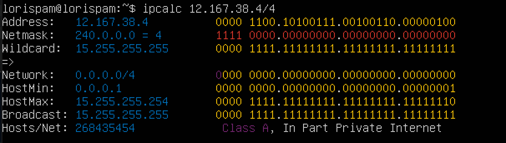
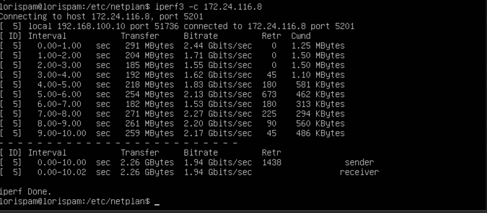
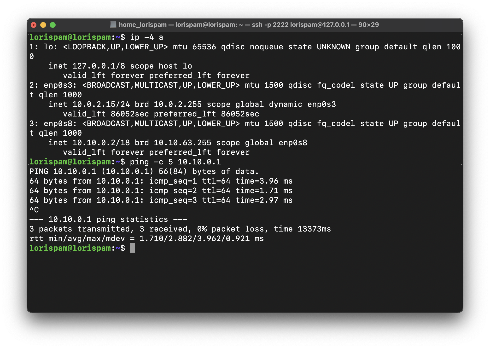
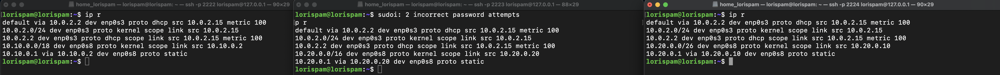

## Part 1. Инструмент ipcalc
### 1.1. Сети и маски
#### 1) Адрес сети 192.167.38.54/13
* Для вывода адреса сети воспользуемся утилитой ipcalc, которую предварительно скачаем командой `sudo apt install ipcalc`.  
  Далее введём команду `ipcalc -b 192.167.38.54/13`  
    
  Флаг `-b` позволяет скрыть двоичный вывод.

#### 2) Перевод маски 255.255.255.0 в префиксную и двоичную запись, /15 в обычную и двоичную, 11111111.11111111.11111111.11110000 в обычную и префиксную
* Воспользуемся командой `ipcalc 255.255.255.0`  
    
  Префиксная запись `/24`. Двоичная запись - `11111111.11111111.11111111.00000000`

* Воспользуемся командой `ipcalc 12.167.38.4/15`  
    
  Минимальный хост - `12.167.0.1`. Максимальный хост - `12.167.255.254`.

* Посчитаем количество ненулевых бит в 11111111.11111111.11111111.11110000 и получим - 28. Воспользуемся командой `ipcalc 192.167.38.54/28`  
    
  Обычная запись - `255.255.255.240`. Префиксная запись - `/28`.  

#### 3) Минимальный и максимальный хост в сети 12.167.38.4 при масках: /8, 11111111.11111111.00000000.00000000, /4
* Воспользуемся командой `ipcalc 12.167.38.4/8`  
    
  Минимальный хост - `12.0.0.1`. Максимальный хост - `12.255.255.254`.

* Воспользуемся командой `ipcalc 12.167.38.4/16`  
    
  Минимальный хост - `12.167.0.1`. Максимальный хост - `12.167.255.254`.

* Воспользуемся командой `ipcalc 12.167.38.4/23`  
    
  Минимальный хост - `12.167.38.1`. Максимальный хост - `12.167.39.254`.

* Воспользуемся командой `ipcalc 12.167.38.4/4`  
    
  Минимальный хост - `0.0.0.1`. Максимальный хост - `15.255.255.254`.

### 1.2. Localhost
#### Определить и записать в отчёт, можно ли обратиться к приложению, работающему на localhost, со следующими IP: 194.34.23.100, 127.0.0.2, 127.1.0.1, 128.0.0.1
* Пишем в гугле "localhost" и в первой ссылке на википедию видим, что для localhost зарезервирован диапазон ip адресов от 127.0.0.1 до 127.255.255.254 включительно. Из этого можем сделать вывод, что мы сможем обратиться к приложениям, работающим со следующими ip: `127.0.0.2`, `127.1.0.1`.  
  Проверим:
* Воспользуемся командой `ipcalc 194.34.23.100`  
    
  Интерфейс loopback отсутствует в строке "Hosts/Net", следовательно данный адрес нам не подходит.

* Воспользуемся командой `ipcalc 127.0.0.2`  
    
  Loopback присутствует, следовательно адрес нам подходит.

* Воспользуемся командой `ipcalc 127.1.0.1`

    

  Loopback тоже есть, следовательно адрес нам подходит.

* Воспользуемся командой `ipcalc 128.0.0.1`  
    
  Loopback нет, адрес не подходит.

### 1.3. Диапазоны и сегменты сетей
#### 1) Какие из перечисленных IP можно использовать в качестве публичного, а какие только в качестве частных: 10.0.0.45, 134.43.0.2, 192.168.4.2, 172.20.250.4, 172.0.2.1, 192.172.0.1, 172.68.0.2, 172.16.255.255, 10.10.10.10, 192.169.168.1
* Выведем информацию обо всех ip адресах с помощью команды `ipcalc <ip адрес>`  
  
  
  
  Нас интересует строка "Hosts/Net" и конкретно надпись "Private Internet", наличие которой говорит о том, что ip адрес принадлежит частной сети.  
  Вывод:
* Адреса `10.0.0.45`, `192.168.4.2`, `172.20.250.4`, `172.16.255.255`, `10.10.10.10` можно использовать только в качестве частных.
* Адреса `134.43.0.2`, `172.0.2.1`, `192.172.0.1`, `172.68.0.2`, `192.169.168.1` можно использовать в качестве публичных.

#### 2) Какие из перечисленных IP адресов шлюза возможны у сети 10.10.0.0/18: 10.0.0.1, 10.10.0.2, 10.10.10.10, 10.10.100.1, 10.10.1.255
* Воспользуемся командой `ipcalc -b 10.10.0.0/18`  
    
  Возможны адреса `10.10.0.2`, `10.10.10.10` и `10.10.1.255`

## Part 2. Статическая маршрутизация между двумя машинами

#### Поднять две виртуальные машины (далее -- ws1 и ws2)

#### С помощью команды ip a посмотреть существующие сетевые интерфейсы
* ws1  
  
* ws2  
  

#### Описать сетевой интерфейс, соответствующий внутренней сети, на обеих машинах и задать следующие адреса и маски: ws1 - 192.168.100.10, маска /16, ws2 - 172.24.116.8, маска /12
* На обеих машинах выполняем команду `sudo nano /etc/netplan/00-installer-config.yaml` и вносим изменения.
* ws1  && ws2  
  

#### Выполнить команду netplan apply для перезапуска сервиса сети
* ws1  && ws2  
  

### 2.1. Добавление статического маршрута вручную
#### Добавить статический маршрут от одной машины до другой и обратно при помощи команды вида ip r add

#### Пропинговать соединение между машинами
* Команда для ws1:  
  
* Команда для ws2:  
  

### 2.2. Добавление статического маршрута с сохранением
#### Перезапустить машины
* Используем команду `sudo reboot`
#### Добавить статический маршрут от одной машины до другой с помощью файла etc/netplan/00-installer-config.yaml
* ws1  && ws2 
  

#### Пропинговать соединение между машинами
* ws1  && ws2 
  

## Part 3. Утилита iperf3
### 3.1. Скорость соединения
#### Перевести и записать в отчёт: 8 Mbps в MB/s, 100 MB/s в Kbps, 1 Gbps в Mbps
* 8 Mbps = 1 MB/s
* 100 MB/s = 819200 Kbps
* 1 Gbps = 1024 Mbps

### 3.2. Утилита iperf3
#### Измерить скорость соединения между ws1 и ws2
* ws1 выступает в роли клиента. Запуск iperf3 клиент, команда: `iperf3 -c 172.24.116.8`
  
* ws2 выступает в роли сервера. Запуск iperf3 сервер, команда: `iperf3 -s`  
  

## Part 4. Сетевой экран
### 4.1. Утилита iptables
#### Создать файл /etc/firewall.sh, имитирующий фаерволл, на ws1 и ws2:
    #!/bin/sh  

    # Deleting all the rules in the "filter" table (default).  
    iptables -F  
    iptables –X  

#### Нужно добавить в файл подряд следующие правила:

#### 1) на ws1 применить стратегию когда в начале пишется запрещающее правило, а в конце пишется разрешающее правило (это касается пунктов 4 и 5)

#### 2) на ws2 применить стратегию когда в начале пишется разрешающее правило, а в конце пишется запрещающее правило (это касается пунктов 4 и 5)

#### 3) открыть на машинах доступ для порта 22 (ssh) и порта 80 (http)

#### 4) запретить echo reply (машина не должна "пинговаться”, т.е. должна быть блокировка на OUTPUT)

#### 5) разрешить echo reply (машина должна "пинговаться")

* добавляем правила для ws1:  
    
  Запрещаем echo-reply, открываем доступ для портов 22 и 80, разрешаем echo-reply.

* добавляем правила для ws2:  
    
  Разрешаем echo-reply, открываем доступ для портов 22 и 80, запрещаем echo-reply.

#### Запустить файлы на обеих машинах командами `chmod +x /etc/firewall.sh` и `/etc/firewall.sh`
* запускаем файл на ws1, не забываем дописать `sudo`  
    

* запускаем файл на ws2 тоже с `sudo`  
    

* Разница между стратегиями заключается в том, что в первом файле первым подходящим правилом для пакета является запрет, а во втором - разрешение. Применяется только первое подходящее правило, остальные игнорируются.

### 4.2. Утилита nmap
#### Командой ping найти машину, которая не "пингуется", после чего утилитой nmap показать, что хост машины запущен
_Проверка: в выводе nmap должно быть сказано: `Host is up`_
* пингуем ws2 с ws1  
    

* пингуем ws1 с ws2 и видим, что машина не "пингуется". Сразу проверяем утилитой nmap.   
    
  

* Видим сообщение `Host is up`

## Part 5. Статическая маршрутизация сети

- Поднимем пять виртуальных машин (3 рабочие станции (ws11, ws21, ws22) и 2 роутера (r1, r2))

#### 5.1. Настройка адресов машин

- В настройках Virtualbox меняем типы соединения:
  - ws11, ws21, ws21:  
    **Адаптер 1** - NAT  
    **Адаптер 2** -  Внутренняя сеть   
  - r1, r2:  
    **Адаптер1** - NAT  
    **Адаптер 2** - Внутренняя сеть  
    **Адаптер 3** - Внутренняя сеть   

- Благодаря этому у машин появятся новые интерфейсы, которые можно настроить в соответствии со схемой. Настроим конфигурации машин в *etc/netplan/00-installer-config.yaml*

- Изменим конфигурацию рабочих станций _ws11_, _ws21_, _ws22_

  

- Изменим конфигурацию роутеров _r1_, _r2_

- Перезапустим сервис сети с помощбю `sudo netplan apply`. Командой `ip -4 a` проверим, что адрес машины задан верн

  
   

- Пропингуем ws22 с ws21

- Пропингуем r1 с ws11

#### 5.2. Включение переадресации IP-адресов

- Для включения переадресации IP, выполним команду на роутерах: `sysctl -w net.ipv4.ip_forward=1`

   

> Переадресация не будет работать после перезагрузки системы

- Для включения переадресации на постоянной основе, в файле */etc/sysctl.conf* раскомментируем следующую строку: `net.ipv4.ip_forward = 1`

  

> IP-переадресация включена на постоянной основе

#### 5.3. Установка маршрута по-умолчанию

- Настроим маршрут по-умолчанию (шлюз) для рабочих станций. Для этого добавим `default` перед IP роутера в файле конфигураций *etc/netplan/00-installer-config.yaml*

  
  
 

- Примем изменения с помощью` sudo netplan apply`
- Просмотрим с помощью `ip r`, что маршрут был добавлен в таблицу маршрутизации. Первая строчка с _default_ соответсвует добавленным маршрутам

  
  

- Пропингуем с ws11 роутер r2

  

- Покажем на r2, что пинг доходит. Для этого прослушиваем интерфейс _enp0s8_

 

#### 5.4. Добавление статических маршрутов

- Добавим в роутеры r1 и r2 статические маршруты в файле конфигураций

   

- Покажем таблицы с маршрутами с помощью `ip r`

  

    - r1: 10.20.0.0/26 via 10.100.0.12 (2 строка снизу)
    - r2: 10.10.0.0/18 via 10.100.0.11 (3 строка снизу)

- Запустим команды на ws11: `ip r list 10.10.0.0/[маска сети]` и `ip r list 0.0.0.0/0`

-Команда ip r list 10.10.0.0/[маска сети] используется для вывода информации о маршрутах, которые соответствуют заданной сети с указанной маской подсети.

Например, если мы используем команду ip r list 10.10.0.0/24, она выведет информацию о маршрутах, связанных с сетью 10.10.0.0 с маской подсети /24 (или 255.255.255.0).

  

-ip r list 10.10.0.0/18: Эта команда выводит информацию о маршруте к сети 10.10.0.0/18. Результат показывает, что пакеты для этой сети должны быть отправлены через интерфейс enp0s8, и исходный IP-адрес для этих пакетов - 10.10.0.2

#### 5.5. Построение списка маршрутизаторов

- Запустим на r1 команду дампа: `tcpdump -tnv -i _enp0s8_`
- команда tcpdump -tnv -i enp будет непрерывно мониторить и выводить информацию о входящих и исходящих сетевых пакетах на интерфейсе

- При помощи утилиты traceroute построим список маршрутизаторов на пути от _ws11_ до _ws21_

  

> Из дампа на r1 видно, что пакет проходит через маршрутизаторы для достижения указанного адреса. На этом основан принцип работы traceroute.   
Каждый пакет проходит на своем пути определенное количество узлов, пока достигнет своей цели. Причем, каждый пакет имеет свое время жизни. Это количество узлов, которые может пройти пакет перед тем, как он будет уничтожен. Этот параметр записывается в заголовке TTL, каждый маршрутизатор, через который будет проходить пакет уменьшает его на единицу. При TTL=0 пакет уничтожается, а отправителю отсылается сообщение Time Exceeded.   
Команда traceroute linux использует UDP пакеты. Она отправляет пакет с TTL=1 и смотрит адрес ответившего узла, дальше TTL=2, TTL=3 и так пока не достигнет цели. Каждый раз отправляется по три пакета и для каждого из них измеряется время прохождения. Пакет отправляется на случайный порт, который, скорее всего, не занят. Когда утилита traceroute получает сообщение от целевого узла о том, что порт недоступен трассировка считается завершенной.

#### 5.6. Использование протокола **ICMP** при маршрутизации

> **_ICMP_** (англ. Internet Control Message Protocol — протокол межсетевых управляющих сообщений[1]) — сетевой протокол, входящий в стек протоколов TCP/IP. В основном ICMP используется для передачи сообщений об ошибках и других исключительных ситуациях, возникших при передаче данных

- Запустим на r1 команду: `tcpdump -n -i enp0s8 icmp`

  

- Пропингуем с ws11 несуществующий IP с помощью команды: `ping -c 1 10.30.0.111`

  

- Отследим перехват сетевого трафика, проходящего через _enp0s8_ на r1

  

> Таким образом, пакеты, отправителенные на 10.30.0.111, проходят через путь по-умолчанию через роутер r1

## Part 6. Динамическая настройка IP с помощью **DHCP**

- Для r2 настроим в файле /etc/dhcp/dhcpd.conf конфигурацию службы DHCP
- данная конфигурация позволяет DHCP-серверу автоматически назначать IP-адреса
  

- В файле *resolv.conf* пропишем `nameserver 8.8.8.8.`
- nameserver 8.8.8.8 в файле resolv.conf указывает операционной системе, что для разрешения DNS-запросов она должна использовать DNS-сервер с IP-адресом 8.8.8.8,

  

- Перезагрузим службу **DHCP** командой `systemctl restart isc-dhcp-server`

  

///////TRUE>>>>>>>>

- Машину ws21 перезагрузим при помощи `reboot`

- Через `ip a` показажем, что ws21 получила адрес.

> Видим, что ws21 получила динамический IP-адрес 10.20.0.2/26

- Пропингуем ws22 с ws21

##### Указать MAC адрес у ws11, r1 настроить аналогично r2 с выдачей адресов с жесткой привязкой к MAC-адресу

- Указать MAC адрес у ws11, для этого в *etc/netplan/00-installer-config.yaml* надо добавить строки: `macaddress: 10:10:10:10:10:BA`, `dhcp4: true`

  

Для r1 настрой аналогично r2, но сделай выдачу адресов с жесткой привязкой к MAC-адресу (ws11). Проведи аналогичные тесты.

  

##### Запросить с ws21 обновление ip адреса

- Выполним `ip a` до обновления адреса

  

- Запросим с ws21 обновление ip адреса. Для этого выполняем
  - `sudo dhclient -r enp0s8` (-r означает освободить IP-адрес)
  - `sudo dhclient`

  

## Part 7. **NAT**

- В файле /etc/apache2/ports.conf на ws22 и r1 измени строку Listen 80 на Listen 0.0.0.0:80, то есть сделай сервер Apache2 общедоступным.

- sudo apt install apache2
  
  

- Запусти веб-сервер Apache командой service apache2 start на ws22 и r1.

  

- Добавь в фаервол, созданный по аналогии с фаерволом из Части 4, на r2 следующие правила:

1) Удаление правил в таблице filter - iptables -F;

2) Удаление правил в таблице "NAT" - iptables -F -t nat;

3) Отбрасывать все маршрутизируемые пакеты - iptables --policy FORWARD DROP.

Запустим файл командами chmod +x /etc/firewall.sh и /etc/firewall.sh

Проверь соединение между ws22 и r1 командой ping.
При запуске файла с этими правилами, ws22 не должна «пинговаться» с r1.

 

Добавь в файл ещё одно правило:

4) Разрешить маршрутизацию всех пакетов протокола ICMP.

Запусти файл также, как в Части 4.

Проверь соединение между ws22 и r1 командой ping.
При запуске файла с этими правилами, ws22 должна «пинговаться» с r1.

 
> ws22 "пингуется" с r1

##### Добавить в файл ещё два правила:

###### 5) включить **SNAT**, а именно маскирование всех локальных ip из локальной сети, находящейся за r2 (по обозначениям из Части 5 - сеть 10.20.0.0)
###### 6) включить **DNAT** на 8080 порт машины r2 и добавить к веб-серверу Apache, запущенному на ws22, доступ извне сети

  

- t - указывает на используемую таблицу
- p - указывает протокол (tcp, udp, udplite)
- s - указывает адрес источника пакета
- d - указывает адрес назначения пакета
- i - задает входящий сетевой интерфейс;
- o - указывает исходящий сетевой интерфейс;
> _DNAT_ — подменяет адрес получателя в заголовке IP-пакета, основное применение — предоставление доступа к сервисам снаружи, находящимся внутри сети  
_SNAT_ — служит для преобразования сетевых адресов, применимо, когда за сервером находятся машины, которым необходимо предоставить доступ в Интернет, при этом от провайдера имеется статический IP-адрес

- Запустим файл командами `chmod +x /etc/firewall.sh` и `/etc/firewall.sh`

##### Проверить соединение по TCP для **SNAT**

Проверь соединение по TCP для SNAT: для этого с ws22 подключиться к серверу Apache на r1 командой:
telnet [адрес] [порт]

  

## Part 8. Дополнительно. Знакомство с SSH Tunnels

Запусти на r2 фаервол с правилами из Части 7.
Также к команде multiport необходимо будет добавить еще один порт (80), который будет проверяться в дальнейшем командой telnet 
`sudo sh firewall.sh`

Запусти веб-сервер Apache на ws22 только на localhost (то есть в файле /etc/apache2/ports.conf измени строку Listen 80 на Listen localhost:80).

  

Воспользуйся Local TCP forwarding с ws21 до ws22, чтобы получить доступ к веб-серверу на ws22 с ws21.
Запустим ssh на машинах 21 и 22:
 
 

Выполненим команду 
`netstat -tulpan | grep ssh`

Данная команда позволяет выцепить действующие TCP-соединения и статистику по протоколам. Утилита grep позволяет отфильтровать их по выполнению этого процесса. После этого можно определить, какие порты выделены для ssh

Займем порт 2233, он свободен. 
Его можно занять командой 
`nano /etc/ssh/sshd_config`
и изменением порта в файле
 

`ssh -L 2233:10.20.0.10:22 lorispam@10.20.0.10 `

 

`ssh -R 8888:10.20.0.10:80 lorispam@10.20.0.10 `
 

Воспользуйся Remote TCP forwarding c ws11 до ws22, чтобы получить доступ к веб-серверу на ws22 с ws11.

telnet для проверки: 
  
  